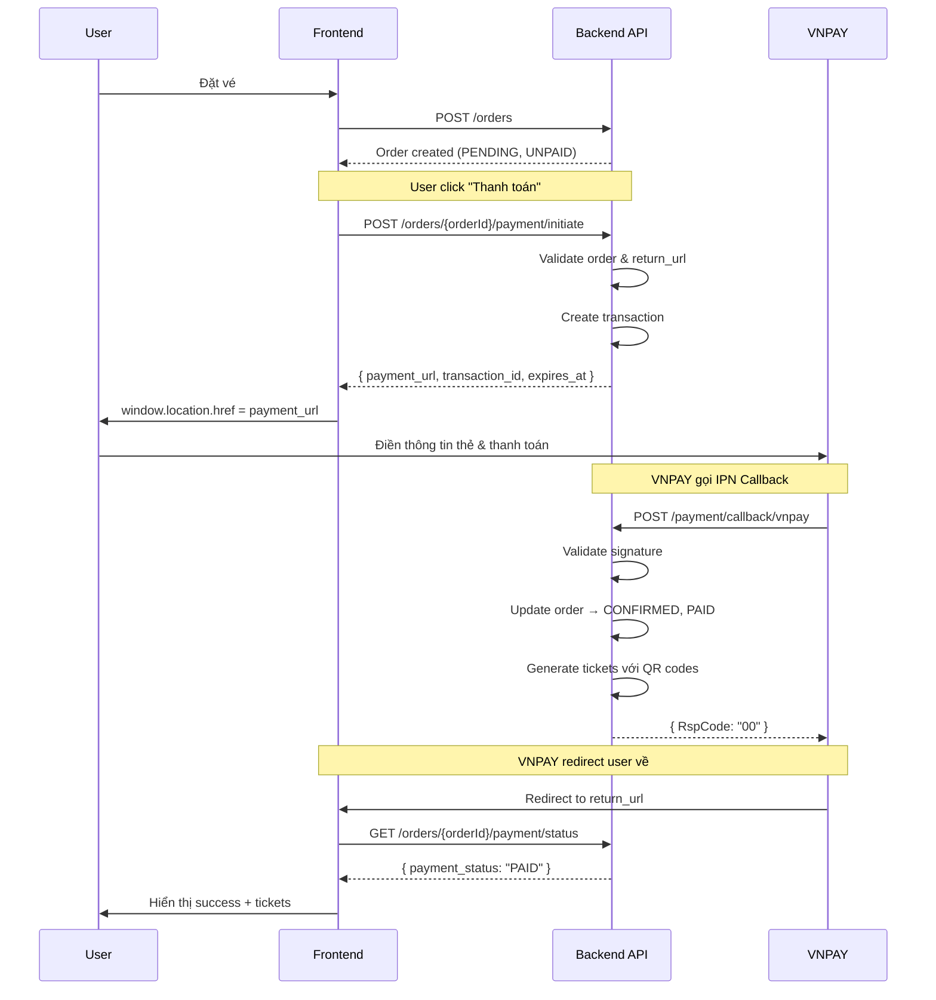

# Payment Gateway API Documentation - Cho Frontend Team

**Phiên bản:** 1.0  
**Ngày cập nhật:** 2025-12-05  
**Backend API Base URL:** `http://localhost:3000`

---

## 📋 Tổng Quan

API Payment Gateway đã được implement đầy đủ với VNPAY, cho phép frontend:
- Tạo payment URL để redirect user đến trang thanh toán
- Nhận callback từ VNPAY sau khi thanh toán
- Kiểm tra trạng thái thanh toán của order

---

## 🔄 Payment Flow



---

## 📡 API Endpoints

### 1. Tạo Order (Existing)

**Endpoint:** `POST /orders`

```typescript
// Request
{
  "event_id": "uuid",
  "items": [
    {
      "ticket_type_id": "uuid",
      "quantity": 2,
      "attendees": [
        { "name": "Nguyen Van A", "email": "a@gmail.com", "phone": "0901234567" },
        { "name": "Nguyen Van B", "email": "b@gmail.com" }
      ]
    }
  ]
}

// Response 201
{
  "id": "order-uuid",
  "order_number": "ORD-1733389658000-ABC123",
  "status": "PENDING",
  "payment_status": "UNPAID",
  "total_amount": 500000,
  "quantity": 2,
  ...
}
```

---

### 2. ✨ Khởi Tạo Thanh Toán (NEW)

**Endpoint:** `POST /orders/{orderId}/payment/initiate`

**Mục đích:** Tạo payment URL để redirect user đến VNPAY

**Authentication:** Required (JWT Bearer Token)

**Request:**

```typescript
// Headers
{
  "Authorization": "Bearer {accessToken}",
  "Content-Type": "application/json"
}

// Body
{
  "payment_method": "VNPAY",  // Required: "VNPAY" | "MOMO" | "ZALOPAY"
  "return_url": "http://localhost:3000/payment/success/{orderId}",  // Required
  "cancel_url": "http://localhost:3000/checkout/{eventId}"  // Optional
}
```

**Response 200:**

```json
{
  "payment_url": "https://sandbox.vnpayment.vn/paymentv2/vpcpay.html?vnp_Amount=50000000&vnp_Command=pay&...",
  "transaction_id": "TXN-abc123",
  "order_id": "order-uuid",
  "amount": 500000,
  "currency": "VND",
  "payment_method": "VNPAY",
  "expires_at": "2025-12-05T16:00:00.000Z"  // Payment URL hết hạn sau 15 phút
}
```

**Response Errors:**

| Status | Error | Khi nào xảy ra |
|--------|-------|----------------|
| `400 Bad Request` | "Đơn hàng đã được thanh toán" | Order đã PAID |
| `400 Bad Request` | "Đơn hàng đã bị hủy" | Order đã CANCELLED |
| `400 Bad Request` | "Invalid return_url domain" | return_url không thuộc FRONTEND_URL whitelist |
| `403 Forbidden` | "Bạn không có quyền xem đơn hàng này" | User không phải chủ order |
| `404 Not Found` | "Không tìm thấy đơn hàng" | Order ID không tồn tại |

**Frontend Implementation:**

```typescript
// services/paymentService.ts
export const initiatePayment = async (orderId: string, returnUrl: string) => {
  const response = await apiClient.post(`/orders/${orderId}/payment/initiate`, {
    payment_method: 'VNPAY',
    return_url: returnUrl,
    cancel_url: window.location.origin + '/checkout'  // Optional
  });
  
  return response.data;
};

// pages/CheckoutPage.tsx
const handlePayment = async () => {
  try {
    const { payment_url } = await initiatePayment(
      orderId,
      `${window.location.origin}/payment/success/${orderId}`
    );
    
    // Redirect đến VNPAY
    window.location.href = payment_url;
  } catch (error) {
    toast.error(error.response?.data?.message || 'Lỗi khởi tạo thanh toán');
  }
};
```

---

### 3. ✨ Kiểm Tra Trạng Thái Thanh Toán (NEW)

**Endpoint:** `GET /orders/{orderId}/payment/status`

**Mục đích:** Lấy thông tin trạng thái thanh toán của order

**Authentication:** Required (JWT Bearer Token)

**Response 200:**

```json
{
  "order_id": "order-uuid",
  "payment_status": "PAID",  // "UNPAID" | "PAID" | "FAILED" | "REFUNDED"
  "transaction_id": "TXN-abc123",
  "payment_method": "VNPAY",
  "paid_at": "2025-12-05T15:30:00.000Z",
  "amount": 500000,
  "gateway_response": {
    "transaction_no": "14122345",  // Mã giao dịch từ VNPAY
    "bank_code": "NCB",
    "card_type": "ATM"
  }
}
```

**Nếu chưa có transaction:**

```json
{
  "order_id": "order-uuid",
  "payment_status": "UNPAID",
  "transaction_id": null,
  "payment_method": null,
  "paid_at": null,
  "amount": 500000,
  "gateway_response": null
}
```

**Frontend Implementation:**

```typescript
// services/paymentService.ts
export const checkPaymentStatus = async (orderId: string) => {
  const response = await apiClient.get(`/orders/${orderId}/payment/status`);
  return response.data;
};

// pages/PaymentSuccessPage.tsx
useEffect(() => {
  const checkStatus = async () => {
    const status = await checkPaymentStatus(orderId);
    
    if (status.payment_status === 'PAID') {
      setPaymentSuccess(true);
      // Redirect to tickets page
      router.push(`/my-tickets/${orderId}`);
    } else if (status.payment_status === 'FAILED') {
      setPaymentFailed(true);
    }
  };
  
  // Poll every 2 seconds for max 30 seconds
  const interval = setInterval(checkStatus, 2000);
  const timeout = setTimeout(() => clearInterval(interval), 30000);
  
  return () => {
    clearInterval(interval);
    clearTimeout(timeout);
  };
}, [orderId]);
```

---

### 4. 🔔 VNPAY Callback (Backend Only)

**Endpoint:** `POST /payment/callback/vnpay`

**Mục đích:** Nhận thông báo từ VNPAY sau khi user thanh toán

> ⚠️ **LƯU Ý:** Endpoint này được VNPAY gọi trực tiếp, **KHÔNG phải frontend gọi**.

**Request từ VNPAY:**

```json
{
  "vnp_Amount": "50000000",
  "vnp_BankCode": "NCB",
  "vnp_CardType": "ATM",
  "vnp_OrderInfo": "Thanh toan don hang ORD-...",
  "vnp_ResponseCode": "00",
  "vnp_TransactionNo": "14122345",
  "vnp_TransactionStatus": "00",
  "vnp_TxnRef": "ORD-1733389658000-ABC123",
  "vnp_SecureHash": "..."
}
```

**Backend Action:**
1. Validate `vnp_SecureHash`
2. Update order status → `CONFIRMED`, `PAID`
3. Generate tickets với QR codes
4. Send email confirmation (optional)

---

## 🎯 Complete Frontend Flow Example

### Step 1: Create Order

```typescript
// pages/CheckoutPage.tsx
const handleCreateOrder = async () => {
  const orderData = {
    event_id: eventId,
    items: cartItems.map(item => ({
      ticket_type_id: item.ticketTypeId,
      quantity: item.quantity,
      attendees: item.attendees
    }))
  };
  
  const order = await createOrder(orderData);
  setOrderId(order.id);
  setOrderNumber(order.order_number);
  
  // Proceed to payment
  await handlePayment(order.id);
};
```

### Step 2: Initiate Payment

```typescript
const handlePayment = async (orderId: string) => {
  try {
    setLoading(true);
    
    const returnUrl = `${window.location.origin}/payment/return?order_id=${orderId}`;
    
    const { payment_url, expires_at } = await initiatePayment(orderId, returnUrl);
    
    // Optional: Store expiry time
    sessionStorage.setItem('payment_expires_at', expires_at);
    
    // Redirect to VNPAY
    window.location.href = payment_url;
  } catch (error) {
    setLoading(false);
    toast.error(error.response?.data?.message || 'Không thể khởi tạo thanh toán');
  }
};
```

### Step 3: Handle Return from VNPAY

```typescript
// pages/PaymentReturnPage.tsx
const PaymentReturnPage = () => {
  const searchParams = useSearchParams();
  const orderId = searchParams.get('order_id');
  const [status, setStatus] = useState<'checking' | 'success' | 'failed'>('checking');
  
  useEffect(() => {
    if (!orderId) {
      router.push('/');
      return;
    }
    
    const checkPayment = async () => {
      try {
        const paymentStatus = await checkPaymentStatus(orderId);
        
        if (paymentStatus.payment_status === 'PAID') {
          setStatus('success');
          // Optional: Fetch tickets
          const order = await getOrderDetails(orderId);
          setTickets(order.tickets);
        } else {
          setStatus('failed');
        }
      } catch (error) {
        setStatus('failed');
      }
    };
    
    checkPayment();
  }, [orderId]);
  
  if (status === 'checking') {
    return <LoadingSpinner message="Đang xác nhận thanh toán..." />;
  }
  
  if (status === 'success') {
    return (
      <SuccessPage 
        orderNumber={orderNumber}
        tickets={tickets}
        onViewTickets={() => router.push(`/my-tickets/${orderId}`)}
      />
    );
  }
  
  return (
    <FailedPage 
      message="Thanh toán không thành công"
      onRetry={() => router.push(`/checkout/${eventId}`)}
    />
  );
};
```

---

## ⚙️ Environment Setup

### Backend (.env)

```env
# VNPAY Configuration
VNPAY_URL=https://sandbox.vnpayment.vn/paymentv2/vpcpay.html
VNPAY_TMN_CODE=your_merchant_code
VNPAY_HASH_SECRET=your_hash_secret
VNPAY_RETURN_URL=http://localhost:3000/payment/return  # Fallback nếu frontend không gửi
VNPAY_IPN_URL=http://your-backend-domain.com/payment/callback/vnpay

# Frontend URL Whitelist (comma-separated)
FRONTEND_URL=http://localhost:3000,http://localhost:5173,https://yourdomain.com
```

### Frontend (.env)

```env
NEXT_PUBLIC_API_URL=http://localhost:3000
NEXT_PUBLIC_PAYMENT_RETURN_URL=http://localhost:3000/payment/return
```

---

## 🔐 Security & Best Practices

### 1. Return URL Validation

Backend **CHỈ chấp nhận** return_url từ domains trong `FRONTEND_URL` whitelist.

```typescript
// ❌ BAD - Sẽ bị reject
{
  "return_url": "https://malicious-site.com/payment/return"
}

// ✅ GOOD
{
  "return_url": "http://localhost:3000/payment/return"
}
```

### 2. Payment URL Expiration

Payment URL hết hạn sau **15 phút**. Frontend nên:
- Hiển thị countdown timer
- Không cho phép user quay lại sau khi hết hạn
- Suggest retry nếu timeout

```typescript
const PaymentTimer = ({ expiresAt }: { expiresAt: string }) => {
  const [timeLeft, setTimeLeft] = useState(calculateTimeLeft(expiresAt));
  
  useEffect(() => {
    const timer = setInterval(() => {
      const left = calculateTimeLeft(expiresAt);
      setTimeLeft(left);
      
      if (left <= 0) {
        clearInterval(timer);
        toast.warning('Payment URL đã hết hạn. Vui lòng thử lại.');
      }
    }, 1000);
    
    return () => clearInterval(timer);
  }, [expiresAt]);
  
  return <div>Thời gian còn lại: {formatTime(timeLeft)}</div>;
};
```

### 3. Idempotency

Backend đã handle idempotency cho callbacks. Nếu VNPAY gọi callback nhiều lần, chỉ process 1 lần.

Frontend **KHÔNG cần** lo lắng về duplicate processing.

### 4. Error Handling

```typescript
const handlePaymentError = (error: any) => {
  const message = error.response?.data?.message;
  
  switch (error.response?.status) {
    case 400:
      if (message.includes('đã được thanh toán')) {
        router.push(`/my-tickets/${orderId}`);
      } else {
        toast.error(message);
      }
      break;
    case 403:
      toast.error('Bạn không có quyền truy cập order này');
      router.push('/');
      break;
    case 404:
      toast.error('Không tìm thấy đơn hàng');
      router.push('/');
      break;
    default:
      toast.error('Đã xảy ra lỗi. Vui lòng thử lại.');
  }
};
```

---

## 🧪 Testing với VNPAY Sandbox

### Test Cards

**Thẻ test thành công:**
```
Card Number: 9704198526191432198
Card Holder: NGUYEN VAN A
Expiry Date: 07/15
OTP: 123456
```

**Thẻ test thất bại:**
```
Card Number: 9704198526191432199
```

### Test Flow

1. Tạo order với `POST /orders`
2. Initiate payment với `POST /orders/{id}/payment/initiate`
3. Copy `payment_url` và mở trong browser
4. Nhập thông tin thẻ test
5. Hoàn tất thanh toán
6. Được redirect về `return_url`
7. Check status với `GET /orders/{id}/payment/status`
8. Verify order status = `PAID` và tickets đã được tạo

---

## ❓ FAQ

### Q: Payment URL hết hạn sau bao lâu?
**A:** 15 phút. Sau thời gian này, user phải initiate payment lại.

### Q: User có thể retry payment nếu thất bại không?
**A:** Có. Gọi lại `POST /orders/{id}/payment/initiate` để tạo payment URL mới.

### Q: Làm sao biết payment đã thành công?
**A:** Sau khi redirect về từ VNPAY, gọi `GET /orders/{id}/payment/status` để check. Nếu `payment_status === 'PAID'` thì thành công.

### Q: Nếu user đóng tab giữa chừng thì sao?
**A:** Order vẫn ở trạng thái `UNPAID`. User có thể vào lại và initiate payment mới.

### Q: Backend có tự động tạo tickets không?
**A:** Có. Sau khi nhận callback từ VNPAY và verify thành công, backend tự động:
1. Update order → `CONFIRMED`, `PAID`
2. Generate tickets với QR codes
3. (Optional) Send email confirmation

### Q: Frontend cần gọi API nào để tạo tickets?
**A:** **KHÔNG cần**. Backend tự động tạo tickets sau khi payment thành công.

---

## 📞 Support

- **Backend API Issues:** Liên hệ backend team
- **VNPAY Issues:** 
  - Email: support@vnpay.vn
  - Hotline: 1900 55 55 77
  - Docs: https://sandbox.vnpayment.vn/apis/docs/

---

## 📝 Changelog

### Version 1.0 (2025-12-05)
- ✨ Initial release
- ✨ Implement `POST /orders/{id}/payment/initiate`
- ✨ Implement `GET /orders/{id}/payment/status`
- ✨ Support dynamic `return_url` from frontend
- ✨ VNPAY callback handling
- ✨ Auto-generate tickets after payment
