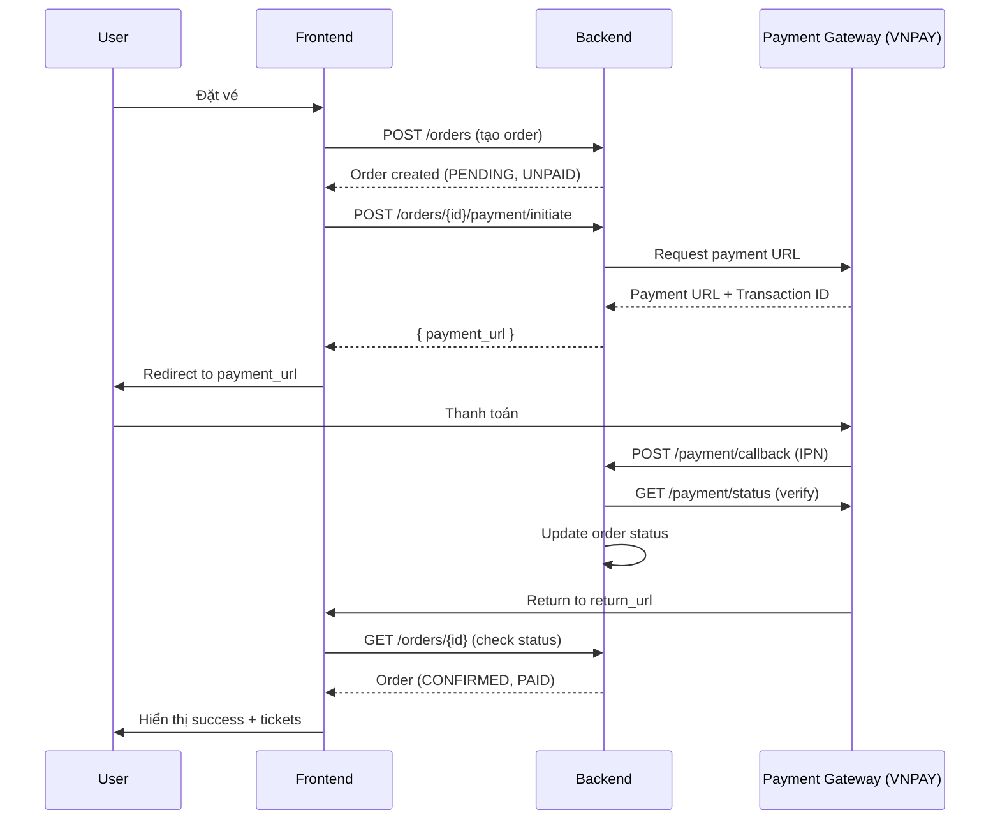

# YÊU CẦU API PAYMENT GATEWAY - CHO BACKEND

**Ngày tạo:** 2025-12-05  
**Người yêu cầu:** Frontend Team  
**Mục đích:** Tích hợp thanh toán cho hệ thống đặt vé

---

## 📋 TỔNG QUAN

Frontend đã hoàn thành giao diện đặt vé (Checkout, Orders Management). Hiện tại đang thiếu phần tích hợp thanh toán thực tế với các payment gateway.

**Trạng thái hiện tại:**
- ✅ Frontend có thể tạo orders (status: PENDING, payment_status: UNPAID)
- ✅ UI/UX hoàn chỉnh cho flow thanh toán
- ❌ Chưa có API để initiate payment
- ❌ Chưa có callback handling sau khi thanh toán
- ❌ Chưa có API để verify payment status

**Payment Gateways cần hỗ trợ:**
1. **VNPAY** (ưu tiên cao nhất)
2. MOMO (tùy chọn)
3. ZALOPAY (tùy chọn)

---

## 🔄 PAYMENT FLOW TỔNG QUAN



---

## 📡 API ENDPOINTS CẦN TRIỂN KHAI

### 1. Khởi tạo thanh toán

**Endpoint:** `POST /orders/{orderId}/payment/initiate`

**Quyền:** User đã login (chủ order)

**Headers:**
```http
Authorization: Bearer {token}
Content-Type: application/json
```

**Request Body:**
```json
{
  "payment_method": "VNPAY",  // "VNPAY" | "MOMO" | "ZALOPAY"
  "return_url": "https://example.com/order-success/{orderId}",  // Frontend URL
  "cancel_url": "https://example.com/checkout/{eventId}"  // Optional
}
```

**Response (200 OK):**
```json
{
  "payment_url": "https://sandbox.vnpayment.vn/paymentv2/vpcpay.html?vnp_Amount=...",
  "transaction_id": "TXN-20241205-ABC123",
  "order_id": "uuid-order",
  "amount": 500000,
  "currency": "VND",
  "payment_method": "VNPAY",
  "expires_at": "2024-12-05T16:00:00Z"  // Payment URL hết hạn sau 15 phút
}
```

**Response Errors:**
- `400`: Order đã thanh toán / đã hủy
- `404`: Order không tồn tại
- `403`: Không có quyền truy cập order này
- `500`: Lỗi kết nối với payment gateway

**Lưu ý Backend:**
- Lưu `transaction_id` vào database để tracking
- Set timeout cho payment URL (recommend: 15 phút)
- Không cho phép initiate payment nếu order đã PAID/CANCELLED
- Validate `return_url` phải là domain hợp lệ

---

### 2. Webhook/Callback từ Payment Gateway (IPN - Instant Payment Notification)

**Endpoint:** `POST /payment/callback/vnpay`  
*(Tương tự cho MOMO: `/payment/callback/momo`, ZALOPAY: `/payment/callback/zalopay`)*

**Quyền:** Public (nhưng validate signature)

**Request Body (Example VNPAY):**
```json
{
  "vnp_TmnCode": "MERCHANT_CODE",
  "vnp_Amount": "50000000",  // Nhân 100 (500,000 VND)
  "vnp_BankCode": "NCB",
  "vnp_CardType": "ATM",
  "vnp_OrderInfo": "Thanh toan don hang ORD-...",
  "vnp_TransactionNo": "14122345",
  "vnp_ResponseCode": "00",  // "00" = Success
  "vnp_TxnRef": "TXN-20241205-ABC123",  // transaction_id đã tạo
  "vnp_SecureHash": "abc123...",
  "vnp_PayDate": "20241205153000"
}
```

**Response (200 OK):**
```json
{
  "RspCode": "00",
  "Message": "Confirm Success"
}
```

**Backend phải làm:**
1. **Validate signature** (vnp_SecureHash) để đảm bảo request từ VNPAY
2. Check `vnp_ResponseCode`:
   - `"00"` = Thành công → Update order
   - Khác → Thanh toán thất bại
3. **Tìm order** từ `vnp_TxnRef` (transaction_id)
4. **Update order:**
   - `payment_status` = "PAID"
   - `status` = "CONFIRMED"
   - `paid_at` = current timestamp
5. **Generate tickets** với QR codes (nếu chưa có)
6. **(Optional)** Send email confirmation
7. **Idempotency:** Nếu callback gọi nhiều lần, chỉ process 1 lần

**Security:**
- ✅ Validate `vnp_SecureHash` với secret key
- ✅ Check amount match với order.total_amount
- ✅ Prevent replay attacks (check transaction đã process chưa)

---

### 3. Verify Payment Status (Optional nhưng recommended)

**Endpoint:** `GET /orders/{orderId}/payment/status`

**Quyền:** User đã login (chủ order)

**Response (200 OK):**
```json
{
  "order_id": "uuid-order",
  "payment_status": "PAID",  // "UNPAID" | "PAID" | "FAILED" | "REFUNDED"
  "transaction_id": "TXN-20241205-ABC123",
  "payment_method": "VNPAY",
  "paid_at": "2024-12-05T15:30:00Z",
  "amount": 500000,
  "gateway_response": {
    "transaction_no": "14122345",
    "bank_code": "NCB",
    "card_type": "ATM"
  }
}
```

**Use case:**
- Frontend poll endpoint này sau khi user return từ payment gateway
- Verify payment thực sự thành công (không chỉ dựa vào callback)

---

### 4. Query Payment Gateway Status (Backend internal, optional)

Nếu callback bị miss, backend cần có cronjob query trực tiếp VNPAY API để check status.

**VNPAY Query API:**
- Endpoint: `https://sandbox.vnpayment.vn/merchant_webapi/api/transaction`
- Method: GET
- Params: vnp_RequestId, vnp_TxnRef, vnp_TransactionDate, ...

**Recommendation:**
- Cronjob chạy mỗi 5 phút
- Query các orders có `payment_status = UNPAID` và transaction_id tồn tại
- Update status nếu thanh toán đã thành công trên VNPAY

---

## 🔐 VNPAY INTEGRATION DETAILS

### Thông tin cần thiết

Để tích hợp VNPAY, backend cần:

1. **Merchant Account:**
   - `vnp_TmnCode` (Terminal/Merchant Code)
   - `vnp_HashSecret` (để tạo/validate signature)
   - `vnp_Url` (Payment URL, sandbox hoặc production)

2. **Sandbox Environment:**
   - URL: `https://sandbox.vnpayment.vn/paymentv2/vpcpay.html`
   - Test cards: https://sandbox.vnpayment.vn/apis/docs/huong-dan-test/

3. **Documentation:**
   - https://sandbox.vnpayment.vn/apis/docs/huong-dan-tich-hop/

### Tạo Payment URL

**Parameters bắt buộc:**
```
vnp_Version=2.1.0
vnp_Command=pay
vnp_TmnCode={MERCHANT_CODE}
vnp_Amount={amount * 100}  // VND, nhân 100
vnp_CurrCode=VND
vnp_TxnRef={transaction_id}  // Unique transaction reference
vnp_OrderInfo={order_description}
vnp_OrderType=billpayment
vnp_Locale=vn
vnp_ReturnUrl={return_url}
vnp_IpAddr={user_ip}
vnp_CreateDate={yyyyMMddHHmmss}
vnp_SecureHash={hash}  // SHA256 or SHA512
```

**Tạo SecureHash:**
1. Sort tất cả parameters theo alphabet (trừ vnp_SecureHash)
2. Tạo query string: `vnp_Amount=50000000&vnp_Command=pay&...`
3. Hash: `HMACSHA512(query_string, vnp_HashSecret)`
4. Append: `&vnp_SecureHash={hash}`

---

## 📊 DATABASE SCHEMA REQUIREMENTS

### Bảng `payments` (hoặc thêm vào `orders`)

```sql
CREATE TABLE payments (
  id UUID PRIMARY KEY,
  order_id UUID REFERENCES orders(id),
  transaction_id VARCHAR(100) UNIQUE,  -- TXN-... từ backend
  payment_method VARCHAR(20),  -- VNPAY, MOMO, ZALOPAY
  amount DECIMAL(12,2),
  currency VARCHAR(3) DEFAULT 'VND',
  
  -- Payment Gateway Info
  gateway_transaction_no VARCHAR(50),  -- vnp_TransactionNo
  gateway_response_code VARCHAR(10),
  gateway_bank_code VARCHAR(20),
  gateway_card_type VARCHAR(20),
  
  -- Status
  status VARCHAR(20),  -- PENDING, SUCCESS, FAILED, CANCELLED
  
  -- URLs
  payment_url TEXT,
  return_url TEXT,
  
  -- Timestamps
  initiated_at TIMESTAMP,
  paid_at TIMESTAMP,
  expires_at TIMESTAMP,
  
  -- Raw response for debugging
  gateway_response_raw JSONB,
  
  created_at TIMESTAMP DEFAULT NOW(),
  updated_at TIMESTAMP DEFAULT NOW()
);

CREATE INDEX idx_payments_order_id ON payments(order_id);
CREATE INDEX idx_payments_transaction_id ON payments(transaction_id);
CREATE INDEX idx_payments_status ON payments(status);
```

---

## ⚠️ ERROR HANDLING

### Payment Gateway Errors

Backend cần handle các cases:

| Gateway Response | Action |
|------------------|--------|
| `00` - Success | Update order → PAID, generate tickets |
| `07` - Transaction suspicion | Manual review required |
| `09` - Card not registered for internet banking | Notify user |
| `10` - Incorrect OTP | Notify user, allow retry |
| `11` - Timeout | Keep UNPAID, allow retry |
| `12` - Card locked | Notify user |
| `13` - Invalid OTP | Notify user |
| `24` - Transaction cancelled | Update order → CANCELLED |
| `51` - Insufficient balance | Notify user |
| `65` - Transaction limit exceeded | Notify user |
| Other | Log error, notify user |

### Timeout Handling

- Payment URL expires sau 15 phút
- Nếu user không complete trong 15 phút → Order vẫn UNPAID
- User có thể retry bằng cách initiate payment lại

---

## 🔒 SECURITY CHECKLIST

- [ ] Validate signature trên mọi callback từ payment gateway
- [ ] Sanitize user input (return_url, cancel_url)
- [ ] Whitelist return_url domain (chỉ cho phép frontend domain)
- [ ] Implement rate limiting cho `/payment/initiate` (prevent spam)
- [ ] Log tất cả payment transactions
- [ ] Encrypt sensitive data trong database
- [ ] Use HTTPS cho tất cả endpoints
- [ ] Implement idempotency cho callbacks
- [ ] Store vnp_HashSecret trong environment variables, không commit vào code

---

## 📝 TESTING REQUIREMENTS

### Test Cases cần Backend cover

1. **Happy Path:**
   - Initiate payment → Redirect → Callback success → Order PAID

2. **Failed Payment:**
   - Initiate payment → User cancel → Callback failed → Order UNPAID

3. **Timeout:**
   - Initiate payment → User không complete trong 15 phút → Order UNPAID

4. **Duplicate Callback:**
   - Callback gọi 2 lần → Chỉ process 1 lần (idempotency)

5. **Invalid Signature:**
   - Callback với signature sai → Reject (403)

6. **Amount Mismatch:**
   - Callback với amount khác order.total_amount → Reject

7. **Retry Payment:**
   - Order UNPAID → Initiate payment lại → Thành công

### Test Data (VNPAY Sandbox)

**Thẻ test thành công:**
```
Card Number: 9704198526191432198
Card Holder: NGUYEN VAN A
Expiry Date: 07/15
OTP: 123456
```

**Thẻ test thất bại:**
```
Card Number: 9704198526191432199
```

---

## 📤 DELIVERABLES

Backend team cần deliver:

1. **API Endpoints:**
   - ✅ `POST /orders/{id}/payment/initiate`
   - ✅ `POST /payment/callback/vnpay`
   - ✅ `GET /orders/{id}/payment/status`

2. **Documentation:**
   - Swagger/OpenAPI specs cho các endpoints
   - Error codes và messages

3. **Database Migration:**
   - Schema cho bảng `payments`

4. **Testing:**
   - Unit tests cho payment logic
   - Integration tests với VNPAY sandbox

5. **Deployment:**
   - Environment variables setup (vnp_TmnCode, vnp_HashSecret)
   - Cronjob cho query payment status (nếu có)

---

## 🚀 PRIORITY & TIMELINE

**Phase 1 (High Priority):**
- VNPAY integration (initiate + callback)
- Basic error handling
- **Timeline:** 1 week

**Phase 2 (Medium Priority):**
- Payment status verification
- Cronjob cho missed callbacks
- **Timeline:** 3-5 days

**Phase 3 (Low Priority - Optional):**
- MOMO integration
- ZALOPAY integration
- **Timeline:** TBD

---

## 📞 CONTACT

**Frontend Team:**
- Có thắc mắc về flow, UI/UX → Liên hệ frontend lead
- Test integration → Cần frontend hỗ trợ test trên sandbox

**VNPAY Support:**
- Email: support@vnpay.vn
- Hotline: 1900 55 55 77

---

## 📎 REFERENCES

- [VNPAY API Documentation](https://sandbox.vnpayment.vn/apis/docs/huong-dan-tich-hop/)
- [Frontend Orders API Documentation](file:///c:/Users/nguye/Documents/DATN/code/ticket-event-qr-web/doc/FRONTEND_ORDERS_API_DOCUMENTATION.md)
- [MOMO API Documentation](https://developers.momo.vn/)
- [ZALOPAY API Documentation](https://docs.zalopay.vn/)

---

**Người tạo:** Frontend Team  
**Ngày cập nhật:** 2025-12-05  
**Version:** 1.0
