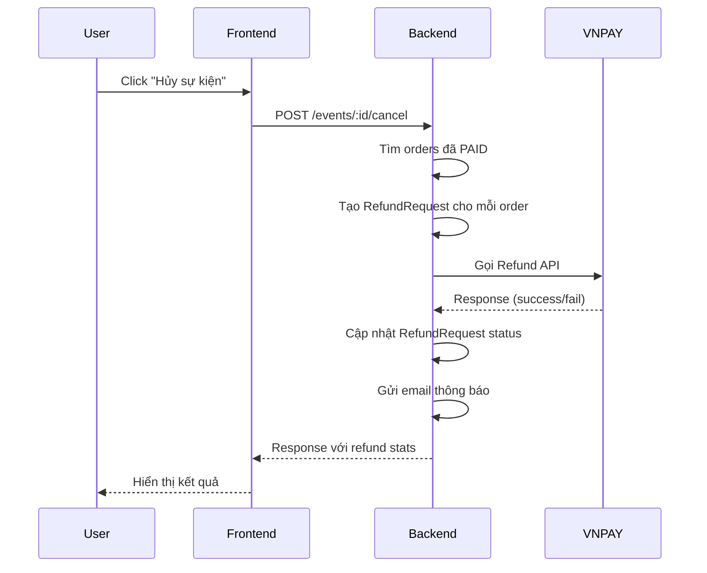

# VNPAY Refund Flow - Tài liệu cho Frontend

## 1. Tổng quan luồng Refund



---

## 2. API Endpoints

### 2.1. Hủy sự kiện (Trigger Refund)

```http
POST /events/:eventId/cancel
Authorization: Bearer <token>
Content-Type: application/json

{
  "reason": "Cancelled by organizer"  // Optional
}
```

**Response:**
```json
{
  "id": "bf997b82-240b-40ee-aac9-a1097d9eaa66",
  "status": "CANCELLED",
  "cancelled_at": "2025-12-26T14:59:08.000Z",
  ...
}
```

> ⚠️ **Lưu ý:** Khi cancel event, backend tự động xử lý refund cho tất cả orders đã PAID. Frontend không cần gọi API refund riêng.

---

### 2.2. Lấy danh sách Refund Requests

```http
GET /refunds
Authorization: Bearer <token>
```

**Query params:**
| Param | Type | Description |
|-------|------|-------------|
| `status` | string | Filter by status: `PENDING`, `PROCESSING`, `COMPLETED`, `FAILED` |
| `event_id` | string | Filter by event |
| `page` | number | Page number (default: 1) |
| `limit` | number | Items per page (default: 10) |

**Response:**
```json
{
  "data": [
    {
      "id": "3a283cb3-9327-42df-bcfc-3add1544d088",
      "order_id": "20ebe006-7899-41ee-8668-b3bbaad5897a",
      "refund_amount": "500000",
      "refund_type": "AUTOMATIC",
      "status": "COMPLETED",
      "reason": "Event cancelled: Cancelled by organizer",
      "gateway_refund_id": "15370858",
      "processed_at": "2025-12-26T14:59:09.000Z",
      "created_at": "2025-12-26T14:59:08.000Z",
      "order": {
        "order_number": "ORD-1766761064471-PMOQSTFPI",
        "total_amount": "500000",
        "user": {
          "email": "customer@example.com",
          "full_name": "Nguyen Van A"
        }
      }
    }
  ],
  "meta": {
    "total": 1,
    "page": 1,
    "limit": 10,
    "totalPages": 1
  }
}
```

---

### 2.3. Lấy Refund của User (My Refunds)

```http
GET /refunds/my/refunds
Authorization: Bearer <token>
```

**Response:** Tương tự như GET /refunds nhưng chỉ trả về refunds của user hiện tại.

---

### 2.4. Chi tiết Refund Request

```http
GET /refunds/:id
Authorization: Bearer <token>
```

---

## 3. Trạng thái Refund (RefundStatus)

| Status | Mô tả | Màu gợi ý |
|--------|-------|-----------|
| `PENDING` | Đang chờ xử lý | 🟡 Yellow |
| `PROCESSING` | VNPAY đã nhận, đang chờ ngân hàng xử lý (1-3 ngày) | 🔵 Blue |
| `COMPLETED` | Hoàn tiền thành công | 🟢 Green |
| `FAILED` | Hoàn tiền thất bại | 🔴 Red |

> ⚠️ **Lưu ý quan trọng:**
> - Sau khi gọi VNPAY Refund API thành công, trạng thái ban đầu sẽ là **PROCESSING** (không phải COMPLETED ngay)
> - Điều này tương ứng với `vnp_TransactionStatus: "05"` từ VNPAY (đang chờ ngân hàng duyệt)
> - Tiền sẽ về tài khoản khách hàng sau 1-3 ngày làm việc

---

## 4. Loại Refund (RefundType)

| Type | Mô tả |
|------|-------|
| `AUTOMATIC` | Tự động khi hủy sự kiện |
| `MANUAL` | Thủ công bởi admin |
| `PARTIAL` | Hoàn tiền một phần |

---

## 5. Data Structure

### RefundRequest

```typescript
interface RefundRequest {
  id: string;
  order_id: string;
  refund_amount: string;        // Decimal as string
  refund_type: 'AUTOMATIC' | 'MANUAL' | 'PARTIAL';
  status: 'PENDING' | 'PROCESSING' | 'COMPLETED' | 'FAILED';
  reason: string;
  gateway_refund_id: string | null;  // VNPAY transaction ID
  processed_at: string | null;       // ISO datetime
  created_at: string;
  updated_at: string;
  
  // Relations
  order?: Order;
}
```

### Order (với refund info)

```typescript
interface Order {
  id: string;
  order_number: string;
  payment_status: 'UNPAID' | 'PAID' | 'REFUNDED' | 'PARTIALLY_REFUNDED';
  total_amount: string;
  
  // Refund relations
  refund_requests?: RefundRequest[];
}
```

---

## 6. Yêu cầu UI Frontend

### 6.1. Trang Chi tiết Sự kiện (Event Detail)

Khi event có status `CANCELLED`:
- [ ] Hiển thị badge "Đã hủy" màu đỏ
- [ ] Hiển thị thông tin hoàn tiền:
  - Số orders đã được hoàn tiền
  - Tổng số tiền đã hoàn
  - Số orders đang chờ hoàn tiền (nếu có)

### 6.2. Trang Quản lý Hoàn tiền (Refund Management)

**Cho Organizer/Admin:**
- [ ] Bảng danh sách refund requests
- [ ] Columns: Order Number, Customer, Amount, Status, Date, Actions
- [ ] Filter by status
- [ ] Search by order number / customer email
- [ ] Export to Excel

### 6.3. Trang Lịch sử Giao dịch (My Orders/Transactions)

**Cho Customer:**
- [ ] Hiển thị status hoàn tiền trên order đã refund
- [ ] Chi tiết refund khi click vào order
- [ ] Thông tin:
  - Số tiền hoàn: `refund_amount`
  - Ngày hoàn: `processed_at`
  - Mã giao dịch VNPAY: `gateway_refund_id`
  - Lý do: `reason`

### 6.4. Popup Xác nhận Hủy Sự kiện

```
┌─────────────────────────────────────────────┐
│         ⚠️ Xác nhận hủy sự kiện             │
├─────────────────────────────────────────────┤
│                                             │
│  Bạn có chắc chắn muốn hủy sự kiện này?     │
│                                             │
│  📋 Thông tin hoàn tiền:                    │
│  • Số orders đã thanh toán: 5               │
│  • Tổng số tiền sẽ hoàn: 2,500,000 VND      │
│                                             │
│  ⏱️ Thời gian xử lý:                        │
│  • Hoàn tiền tự động qua VNPAY              │
│  • Thời gian: 1-3 ngày làm việc             │
│                                             │
│  Lý do hủy: [________________________]      │
│                                             │
│  [Hủy bỏ]              [Xác nhận hủy]       │
└─────────────────────────────────────────────┘
```

### 6.5. Email Notifications

Backend gửi email tự động:
- ✉️ **Cho Customer:** Thông báo hoàn tiền thành công
- ✉️ **Cho Organizer:** Thông báo sự kiện đã hủy + refund stats

---

## 7. Xử lý Lỗi

### Refund thất bại

Khi refund fail, hệ thống sẽ:
1. Retry tự động 5 lần (với delay exponential backoff)
2. Nếu vẫn fail → status = `FAILED`
3. Admin/Organizer cần xử lý thủ công

**UI hiển thị:**
```
❌ Hoàn tiền thất bại
Lý do: [error message from VNPAY]
Vui lòng liên hệ support để được hỗ trợ.
```

---

## 8. Timeline hoàn tiền VNPAY

| Bước | Thời gian | Mô tả |
|------|-----------|-------|
| 1 | Ngay lập tức | Backend gọi VNPAY Refund API |
| 2 | 1-5 giây | VNPAY xác nhận yêu cầu hoàn tiền |
| 3 | 1-3 ngày | Tiền về tài khoản ngân hàng khách hàng |

> ⚠️ **Lưu ý cho Frontend:** Hiển thị thông báo rằng việc hoàn tiền sẽ mất 1-3 ngày làm việc để tiền về tài khoản.

---

## 9. Testing Checklist

- [ ] Tạo order → Thanh toán VNPAY → Cancel event → Verify refund
- [ ] Kiểm tra email notification
- [ ] Kiểm tra UI hiển thị đúng trạng thái
- [ ] Kiểm tra My Orders hiển thị refund info
- [ ] Test với multiple orders
